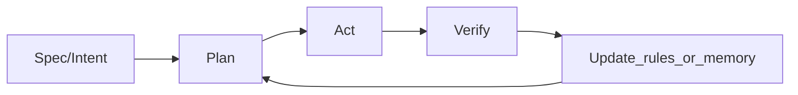

# Теоретична частина: правила, команди та навички (Rules, Commands, Skills)

<v-clicks>

- Чому **ad-hoc промптинг** ламається на масштабі
- Як зробити поведінку агента **стабільною та повторюваною**
- Які **артефакти** залишаються в репозиторії (rules / commands / memory)

</v-clicks>

<!--
Джерела/ідеї: @docs/chatgpt-reasearch.md (вступ, ad-hoc vs системний підхід),
@docs/claude-research.md (Agentic Engineering, intent-driven development).
-->

---

# Структура (Outline) — ~70–80 слайдів

<v-clicks>

- **0. Setup**: цілі, очікування, Plan→Act
- **1. Shift**: Copilot → Agentic IDE (Assisted vs Augmented)
- **2. Architecture**: Context + Tools + Memory
- **3. Rules**: Cursor / Claude Code / Copilot / `AGENTS.md`
- **4. Workflows**: Commands vs Skills, multi-agent patterns
- **5. Memory Bank**: протокол, файли, рівні складності
- **6. Quality/Security**: guardrails, anti-patterns, ліцензії
- **7. Requirements→Rules**: як витягувати правила з вимог
- **8. Wrap-up**: чекліст, Q&A, джерела

</v-clicks>

<!--
Мапа джерел:
- chatgpt-reasearch.md: ad-hoc vs системний підхід, правила/антипатерни
- claude-research.md: Agentic IDE архітектура, OODA, MCP, memory bank і процес
- gemini-research.md: порівняння Cursor/Claude/Copilot rules systems
- gemini-research-agents.md: AGENTS.md стандарт + ризики (prompt injection)
-->

# Після цієї частини ви зможете…

<v-clicks>

- Пояснити, що таке **Agentic IDE** і чим вона відрізняється від Copilot-стилю
- Розкласти “контекст” на **правила (rules)**, **команди (commands)**, **памʼять (memory)**
- Налаштувати мінімальний набір **guardrails**: що агенту можна/не можна робити
- Вибудувати базовий **workflow**: Spec → Plan → Act → Verify → Update

</v-clicks>

<!--
Фокус: майстерність керування контекстом (context governance), а не “хитрі промпти”.
-->

---
layout: center
---

# Практика взаємодії: Plan → Act (замість “пиши код одразу”)

<v-clicks>

- **Plan**: що змінюємо, де, як перевіряємо
- **Act**: робимо лише те, що в плані
- **Verify**: тести/збірка/перевірки
- **Update**: правила/памʼять, щоб агент “навчився один раз”

</v-clicks>

<!--
Ідея Plan/Act як захист від передчасних великих змін: @docs/gemini-research.md (Plan/Act pattern).
-->

