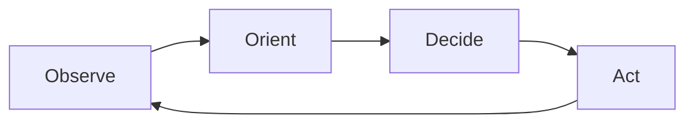

<Lang>
<template #uk>

# Зсув парадигми: Copilot → Agentic IDE

<v-clicks>

- Copilot-ера: **autocomplete** + “підкажи фрагмент”
- Agentic-ера: **ціль → план → багато кроків → валідація → рефлексія**
- Роль інженера зміщується: від “друкувати код” до **керувати наміром (intent)**.

</v-clicks>

</template>
<template #en>

# Paradigm shift: Copilot → Agentic IDE

<v-clicks>

- Copilot era: **autocomplete** + “suggest a snippet”
- Agentic era: **goal → plan → many steps → validation → reflection**
- The engineer’s role shifts: from “typing code” to **steering intent**.

</v-clicks>

</template>
</Lang>

<!--
Джерела/ідеї: @docs/claude-research.md (Agentic Engineering, OODA),
@docs/chatgpt-reasearch.md (вступ: від промптингу до системи).
-->

---

<Lang>
<template #uk>

# Ad-hoc промптинг vs системний підхід

<v-clicks>

- **Ad-hoc**: кожного разу пояснюємо контекст заново → нестабільні результати
- **System approach**: правила + команди + памʼять → стабільність і повторюваність
- Менше “магії промпта”, більше **структури та критеріїв успіху**.

</v-clicks>

> “Структура і контекст важливіші за хитрі формулювання.”

</template>
<template #en>

# Ad-hoc prompting vs system approach

<v-clicks>

- **Ad-hoc**: re-explain context every time → unstable results
- **System approach**: rules + commands + memory → stability and repeatability
- Less “prompt magic”, more **structure and success criteria**.

</v-clicks>

> “Structure and context matter more than clever wording.”

</template>
</Lang>

<!--
Цитата-парафраз із загальної практики prompt engineering; саму ідею та аргументи див. @docs/chatgpt-reasearch.md.
-->

---

<Lang>
<template #uk>

# AI Assisted vs AI Augmented

  

    <h2 class="text-2xl font-bold mb-3">AI Assisted</h2>
    <ul class="list-disc list-inside">
      <li>AI як інструмент підказок</li>
      <li>Локальні зміни (функція/файл)</li>
      <li>Розробник “тримає кермо” постійно</li>
      <li>Невисока автономність</li>
    </ul>
  

  

    <h2 class="text-2xl font-bold mb-3">AI Augmented</h2>
    <ul class="list-disc list-inside">
      <li>AI як партнер (колега)</li>
      <li>Багатофайлові зміни + workflow</li>
      <li>AI планує, виконує, перевіряє</li>
      <li>Вища автономність</li>
    </ul>
  

</template>
<template #en>

# AI Assisted vs AI Augmented

  

    <h2 class="text-2xl font-bold mb-3">AI Assisted</h2>
    <ul class="list-disc list-inside">
      <li>AI as a suggestion tool</li>
      <li>Local changes (function/file)</li>
      <li>The developer “keeps the wheel”</li>
      <li>Low autonomy</li>
    </ul>
  

  

    <h2 class="text-2xl font-bold mb-3">AI Augmented</h2>
    <ul class="list-disc list-inside">
      <li>AI as a partner (colleague)</li>
      <li>Multi-file changes + workflow</li>
      <li>AI plans, executes, verifies</li>
      <li>Higher autonomy</li>
    </ul>
  

</template>
</Lang>

---

<Lang>
<template #uk>

# Що таке “агентність” (Agency)?

<v-clicks>

- **Observe**: код, лінти, логи, git diff, відкриті файли
- **Orient**: правила проєкту + контекст домену + обмеження
- **Decide**: план кроків (і критерії перевірки)
- **Act**: зміни + запуск команд + виправлення.

</v-clicks>

</template>
<template #en>

# What is “agency”?

<v-clicks>

- **Observe**: code, lints, logs, git diff, open files
- **Orient**: project rules + domain context + constraints
- **Decide**: step plan (and verification criteria)
- **Act**: changes + running commands + fixes.

</v-clicks>

</template>
</Lang>

<!--
OODA як ментальна модель агентної роботи: @docs/claude-research.md.
-->

---

<Lang>
<template #uk>

# Agentic loop у IDE: як це виглядає на практиці

1. Агент читає **контекст** (rules + репозиторій + задачу)
2. Створює **план** (що/де/як перевірити)
3. Робить зміни (кілька файлів)
4. Запускає **перевірки** (build/test/lint)
5. Якщо впало — **самокорекція** і повтор перевірок

</template>
<template #en>

# Agentic loop in the IDE: what it looks like in practice

1. The agent reads **context** (rules + repo + task)
2. Creates a **plan** (what/where/how to verify)
3. Makes changes (multiple files)
4. Runs **checks** (build/test/lint)
5. If it fails — **self-correction** and re-run checks

</template>
</Lang>

<!--
Ключова відмінність: “feedback loop” через інструменти, а не лише текст у чаті.
-->

---

<Lang>
<template #uk>

# Де агент в SDLC? (Software Development Life Cycle)

- **Аналіз/дизайн**: PRD, RFC, діаграми, ризики
- **Імплементація**: код, рефакторинг, міграції
- **Тестування**: генерація тестів, покриття edge cases
- **Ревʼю**: чеклісти якості, безпека, стиль
- **Підтримка**: інциденти, triage, документація

</template>
<template #en>

# Where does an agent fit in the SDLC?

- **Analysis/design**: PRD, RFC, diagrams, risks
- **Implementation**: code, refactoring, migrations
- **Testing**: test generation, edge-case coverage
- **Review**: quality checklists, security, style
- **Support**: incidents, triage, documentation

</template>
</Lang>

<!--
Позиціонування LLM/агента в SDLC: @docs/chatgpt-reasearch.md, @docs/claude-research.md.
-->

---

<Lang>
<template #uk>

# Де агентність дає максимум, а де потрібна обережність

  

    <h2 class="text-2xl font-bold mb-3">Найкраще</h2>
    <ul class="list-disc list-inside">
      <li>Багатофайловий рефакторинг</li>
      <li>Додавання тестів</li>
      <li>Міграції / перейменування</li>
      <li>Документація / приклади</li>
    </ul>
  

  

    <h2 class="text-2xl font-bold mb-3">Обережно</h2>
    <ul class="list-disc list-inside">
      <li>Нечіткі вимоги (“зроби краще”)</li>
      <li>Невидимі обмеження (безпека/комплаєнс)</li>
      <li>Великі зміни без Plan→Act</li>
      <li>Будь-які секрети/PII у промптах</li>
    </ul>
  

</template>
<template #en>

# Where agency shines, and where to be cautious

  

    <h2 class="text-2xl font-bold mb-3">Best fit</h2>
    <ul class="list-disc list-inside">
      <li>Multi-file refactoring</li>
      <li>Adding tests</li>
      <li>Migrations / renames</li>
      <li>Documentation / examples</li>
    </ul>
  

  

    <h2 class="text-2xl font-bold mb-3">Be cautious</h2>
    <ul class="list-disc list-inside">
      <li>Vague requirements (“make it better”)</li>
      <li>Hidden constraints (security/compliance)</li>
      <li>Large changes without Plan→Act</li>
      <li>Any secrets/PII in prompts</li>
    </ul>
  

</template>
</Lang>

<!--
Антипатерни (розпливчаті задачі, відсутність DoD) розкриті у @docs/chatgpt-reasearch.md.
-->
