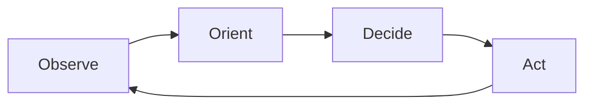

# Зсув парадигми: Copilot → Agentic IDE

<v-clicks>

- Copilot-ера: **autocomplete** + “підкажи фрагмент”
- Agentic-ера: **ціль → план → багато кроків → валідація → рефлексія**
- Роль інженера зміщується: від “друкувати код” до **керувати наміром (intent)**

</v-clicks>

<!--
Джерела/ідеї: @docs/claude-research.md (Agentic Engineering, OODA),
@docs/chatgpt-reasearch.md (вступ: від промптингу до системи).
-->

---

# Ad-hoc промптинг vs системний підхід

<v-clicks>

- **Ad-hoc**: кожного разу пояснюємо контекст заново → нестабільні результати
- **System approach**: правила + команди + памʼять → стабільність і повторюваність
- Менше “магії промпта”, більше **структури та критеріїв успіху**

</v-clicks>

> “Структура і контекст важливіші за хитрі формулювання.”

<!--
Цитата-парафраз із загальної практики prompt engineering; саму ідею та аргументи див. @docs/chatgpt-reasearch.md.
-->

---

# AI Assisted vs AI Augmented (Assisted vs Augmented)

  

    <h2 class="text-2xl font-bold mb-3">AI Assisted</h2>
    <ul class="list-disc list-inside">
      <li>AI як інструмент підказок</li>
      <li>Локальні зміни (функція/файл)</li>
      <li>Розробник “тримає кермо” постійно</li>
      <li>Невисока автономність</li>
    </ul>
  

  

    <h2 class="text-2xl font-bold mb-3">AI Augmented</h2>
    <ul class="list-disc list-inside">
      <li>AI як партнер (колега)</li>
      <li>Багатофайлові зміни + workflow</li>
      <li>AI планує, виконує, перевіряє</li>
      <li>Вища автономність</li>
    </ul>
  

<!--
Ідея/приклад також є в slides-archive.md (Assisted vs Augmented).
-->

---

# Що таке “агентність” (Agency)?

<v-clicks>

- **Observe**: код, лінти, логи, git diff, відкриті файли
- **Orient**: правила проєкту + контекст домену + обмеження
- **Decide**: план кроків (і критерії перевірки)
- **Act**: зміни + запуск команд + виправлення

</v-clicks>

<!--
OODA як ментальна модель агентної роботи: @docs/claude-research.md.
-->

---

# Agentic loop у IDE: як це виглядає на практиці

<v-clicks>

1. Агент читає **контекст** (rules + репозиторій + задачу)
2. Створює **план** (що/де/як перевірити)
3. Робить зміни (кілька файлів)
4. Запускає **перевірки** (build/test/lint)
5. Якщо впало — **самокорекція** і повтор перевірок

</v-clicks>

<!--
Ключова відмінність: “feedback loop” через інструменти, а не лише текст у чаті.
-->

---

# Де агент в SDLC? (Software Development Life Cycle)

<v-clicks>

- **Аналіз/дизайн**: PRD, RFC, діаграми, ризики
- **Імплементація**: код, рефакторинг, міграції
- **Тестування**: генерація тестів, покриття edge cases
- **Ревʼю**: чеклісти якості, безпека, стиль
- **Підтримка**: інциденти, triage, документація

</v-clicks>

<!--
Позиціонування LLM/агента в SDLC: @docs/chatgpt-reasearch.md, @docs/claude-research.md.
-->

---

# Де агентність дає максимум, а де потрібна обережність

  

    <h2 class="text-2xl font-bold mb-3">Найкраще</h2>
    <ul class="list-disc list-inside">
      <li>Багатофайловий рефакторинг</li>
      <li>Додавання тестів</li>
      <li>Міграції / перейменування</li>
      <li>Документація / приклади</li>
    </ul>
  

  

    <h2 class="text-2xl font-bold mb-3">Обережно</h2>
    <ul class="list-disc list-inside">
      <li>Нечіткі вимоги (“зроби краще”)</li>
      <li>Невидимі обмеження (безпека/комплаєнс)</li>
      <li>Великі зміни без Plan→Act</li>
      <li>Будь-які секрети/PII у промптах</li>
    </ul>
  

<!--
Антипатерни (розпливчаті задачі, відсутність DoD) розкриті у @docs/chatgpt-reasearch.md.
-->

