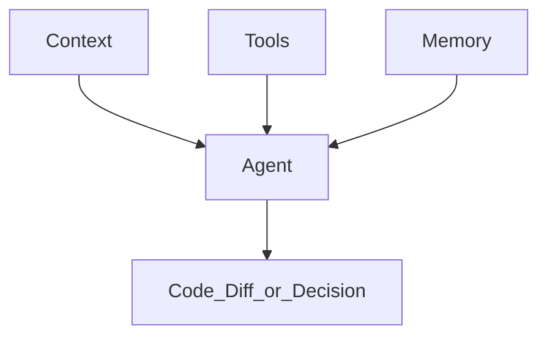
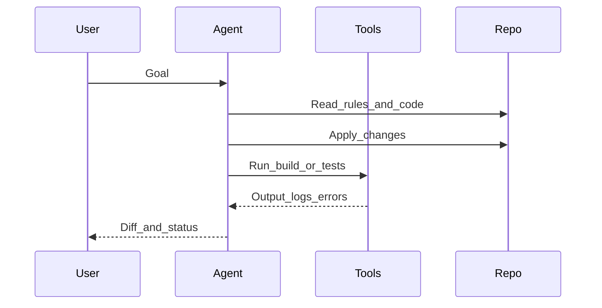

# Архітектура Agentic IDE: Context + Tools + Memory

<v-clicks>

- **Context**: “картина світу” проєкту
- **Tools**: можливість діяти (файли/термінал/браузер/MCP)
- **Memory**: довготривала памʼять поза вікном контексту

</v-clicks>

<!--
Три стовпи автономії: @docs/claude-research.md (Context/Tools/Memory).
-->

---

# 3 стовпи (mental model)

<v-clicks>

- Якщо “плаває” результат → зазвичай проблема в **контексті** або **критеріях**
- Якщо “не перевіряє” → бракує **tool loop** (build/test/lint)
- Якщо “забуває” → потрібна **памʼять** (Memory Bank / рішення / лог прогресу)

</v-clicks>

---

# Context: що реально входить у “контекст”

<v-clicks>

- Кодова база (RAG/індекс, релевантні фрагменти)
- Відкриті файли / виділені шматки / git diff
- **Правила проєкту** (project rules) + стандарти команди
- Документи: PRD/RFC, ADR, README, “memory bank”
- Вихід інструментів: помилки збірки, логи, тести

</v-clicks>

<!--
Ключова теза: агент без контексту = узагальнена LLM, з контекстом = “член команди”.
-->

---

# Типові проблеми з контекстом (і як вони проявляються)

<v-clicks>

- **Немає обмежень** → агент “креативить” не туди (scope creep)
- **Немає прикладів** → стиль/архітектура не збігаються з проєктом
- **Застарілі правила** → пропонує deprecated API / неправильні команди
- **Контекст надто довгий** → важливе тоне, агент починає ігнорувати частину

</v-clicks>

<!--
Антипатерни довгих/суперечливих правил: @docs/chatgpt-reasearch.md, @docs/gemini-research.md.
-->

---

# Tools: що відрізняє агента від “чат-бота”

<v-clicks>

- Файлова система (створювати/редагувати/читати)
- Термінал (install/build/test/export)
- Браузер (перевірки UI/доків)
- Інтеграції через **MCP (Model Context Protocol)**

</v-clicks>

<!--
MCP як стандарт доступу до зовнішніх даних/інструментів: @docs/claude-research.md.
-->

---

# Tool loop: короткий цикл зворотного зв’язку (feedback loop)

<v-clicks>

- Найцінніше: **перевірка реальністю** (build/test) замість “віри в текст”
- В ідеалі — автоматизований повтор: “поки зелено”

</v-clicks>

---

# Memory: чому без неї агент “амнезійний”

<v-clicks>

- LLM **stateless**: нова сесія = “чистий аркуш”
- Довгі сесії → **context saturation** → дрейф від початкових правил
- Памʼять поза чатом: файли, які агент читає/оновлює

</v-clicks>

---

# Види “памʼяті” у практиці

<v-clicks>

- **Rules**: сталі домовленості (стиль, архітектура, обмеження)
- **Docs**: PRD/RFC/ADR (чому і що будуємо)
- **Memory Bank**: поточний фокус + прогрес + рішення
- **Checkpoints**: “знімки стану” для відкату (як концепт)

</v-clicks>

<!--
Memory Bank та checkpoints згадуються в @docs/gemini-research.md і @docs/claude-research.md.
-->

---

# Guardrails: межі для агента (Boundaries)

<v-clicks>

- ✅ **ALWAYS**: описуй план + як перевіряєш (build/test)
- ⚠️ **ASK FIRST**: масові рефактори, видалення файлів, зміна API/схем
- ⛔ **NEVER**: секрети, “хардкод” ключів, обхід політик, небезпечні команди

</v-clicks>

---

# Мінімальний “agentic stack” у репозиторії

<v-clicks>

- `rules/` або `.cursor/rules/` / `CLAUDE.md` / `.github/*instructions*`
- `commands/` / slash commands / prompt templates
- `docs/` (наприклад `docs/memory/`) як **Memory Bank** для довготривалого стану

</v-clicks>

<!--
Далі розберемо конкретні системи правил і стандарти (Cursor/Claude/Copilot/AGENTS.md).
-->

