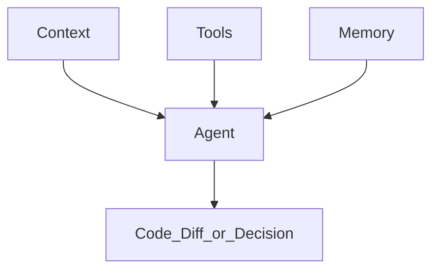
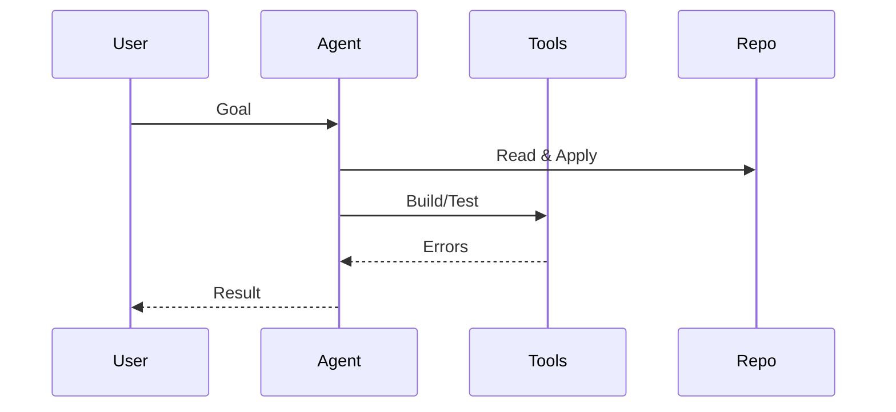

<Lang>
<template #uk>

# Архітектура Agentic IDE: Context + Tools + Memory

<v-clicks>

- **Context**: “картина світу” проєкту
- **Tools**: можливість діяти (файли/термінал/браузер/MCP)
- **Memory**: довготривала памʼять поза вікном контексту.

</v-clicks>

</template>
<template #en>

# Agentic IDE architecture: Context + Tools + Memory

<v-clicks>

- **Context**: the project’s “world model”
- **Tools**: ability to act (files/terminal/browser/MCP)
- **Memory**: long-term memory outside the context window.

</v-clicks>

</template>
</Lang>

<!--
Три стовпи автономії: @docs/claude-research.md (Context/Tools/Memory).
-->

---

<Lang>
<template #uk>

# 3 стовпи (mental model)

<v-clicks>

- Якщо “плаває” результат → зазвичай проблема в **контексті** або **критеріях**
- Якщо “не перевіряє” → бракує **tool loop** (build/test/lint)
- Якщо “забуває” → потрібна **памʼять** (Memory Bank / рішення / лог прогресу).

</v-clicks>

</template>
<template #en>

# Three pillars (mental model)

<v-clicks>

- If results “float” → usually a **context** or **criteria** issue
- If it “doesn’t verify” → missing the **tool loop** (build/test/lint)
- If it “forgets” → you need **memory** (Memory Bank / decisions / progress log).

</v-clicks>

</template>
</Lang>

---

<Lang>
<template #uk>

# Context: що реально входить у “контекст”

<v-clicks>

- Кодова база (RAG/індекс, релевантні фрагменти)
- Відкриті файли / виділені шматки / git diff
- **Правила проєкту** (project rules) + стандарти команди
- Документи: PRD/RFC, ADR, README, “memory bank”, Specifications
- Вихід інструментів: помилки збірки, логи, тести, термінал і т.п.

</v-clicks>

</template>
<template #en>

# Context: what really goes into “context”

<v-clicks>

- Codebase (RAG/index, relevant snippets)
- Open files / selected chunks / git diff
- **Project rules** + team standards
- Docs: PRD/RFC, ADR, README, “memory bank”, specifications
- Tool output: build errors, logs, tests, terminal, etc.

</v-clicks>

</template>
</Lang>

<!--
Ключова теза: агент без контексту = узагальнена LLM, з контекстом = “член команди”.
-->

---

<Lang>
<template #uk>

# Типові проблеми з контекстом (і як вони проявляються)

<v-clicks>

- **Немає обмежень** → агент “креативить” не туди (scope creep)
- **Немає прикладів** → стиль/архітектура не збігаються з проєктом
- **Застарілі правила** → пропонує deprecated API / неправильні команди
- **Контекст надто довгий** → важливе тоне, агент починає ігнорувати частину.

</v-clicks>

</template>
<template #en>

# Common context problems (and how they show up)

<v-clicks>

- **No constraints** → the agent “creates” in the wrong direction (scope creep)
- **No examples** → style/architecture drift from the project
- **Outdated rules** → suggests deprecated APIs / wrong commands
- **Context too long** → important info drowns, the agent ignores part of it.

</v-clicks>

</template>
</Lang>

<!--
Антипатерни довгих/суперечливих правил: @docs/chatgpt-reasearch.md, @docs/gemini-research.md.
-->

---

<Lang>
<template #uk>

# Tools: що відрізняє агента від “чат-бота”

<v-clicks>

- Файлова система (створювати/редагувати/читати)
- Термінал (install/build/test/export)
- Браузер (перевірки UI/доків)
- Інтеграції через **MCP (Model Context Protocol)**.

</v-clicks>

</template>
<template #en>

# Tools: what separates an agent from a “chatbot”

<v-clicks>

- File system (create/edit/read)
- Terminal (install/build/test/export)
- Browser (UI/docs checks)
- Integrations via **MCP (Model Context Protocol)**.

</v-clicks>

</template>
</Lang>

<!--
MCP як стандарт доступу до зовнішніх даних/інструментів: @docs/claude-research.md.
-->

---

<Lang>
<template #uk>

# Tool loop: короткий цикл зворотного зв’язку (feedback loop)

<v-clicks>
  
- Найцінніше: **перевірка реальністю** (build/test) замість “віри в текст”
- В ідеалі — автоматизований повтор: “поки зелено” (quality gates).

</v-clicks>

</template>
<template #en>

# Tool loop: a short feedback cycle

<v-clicks>
  
- Most valuable: **reality check** (build/test) instead of “faith in text”
- Ideally — automated rerun: “until green” (quality gates).

</v-clicks>

</template>
</Lang>

---

<Lang>
<template #uk>

# Memory: чому без неї агент “амнезійний”

<v-clicks>

- LLM **stateless**: нова сесія = “чистий аркуш”
- Довгі сесії → **context saturation** → дрейф від початкових правил
- Памʼять поза чатом: файли, які агент читає/оновлює.

</v-clicks>

</template>
<template #en>

# Memory: why an agent is “amnesic” without it

<v-clicks>

- LLM is **stateless**: a new session = a “blank sheet”
- Long sessions → **context saturation** → drift from the original rules
- Memory outside the chat: files the agent reads/updates.

</v-clicks>

</template>
</Lang>

---

<Lang>
<template #uk>

# Види “памʼяті” у практиці

<v-clicks>

- **Rules**: сталі домовленості (стиль, архітектура, обмеження)
- **Docs**: PRD/RFC/ADR (чому і що будуємо)
- **Memory Bank**: поточний фокус + прогрес + рішення
- **Checkpoints**: “знімки стану” для відкату (як концепт)
- **Git history**: коміти + повідомлення як "хронологія рішень"
- **Tests**: тести як жива специфікація поведінки (living docs)
- **Code comments/JSDoc**: документація в коді про наміри та обмеження.

</v-clicks>

</template>
<template #en>

# Types of “memory” in practice

<v-clicks>

- **Rules**: stable agreements (style, architecture, constraints)
- **Docs**: PRD/RFC/ADR (why and what we build)
- **Memory Bank**: current focus + progress + decisions
- **Checkpoints**: “state snapshots” for rollback (as a concept)
- **Git history**: commits + messages as a “decision timeline”
- **Tests**: tests as living specs (living docs)
- **Code comments/JSDoc**: documentation in code about intent and constraints.

</v-clicks>

</template>
</Lang>

<!--
Memory Bank та checkpoints згадуються в @docs/gemini-research.md і @docs/claude-research.md.
-->

---

<Lang>
<template #uk>

# Guardrails: межі для агента (Boundaries)

<v-clicks>

- ✅ **ALWAYS**: описуй план + як перевіряєш (build/test)
- ⚠️ **ASK FIRST**: масові рефактори, видалення файлів, зміна API/схем
- ⛔ **NEVER**: секрети, “хардкод” ключів, обхід політик, небезпечні команди.

</v-clicks>

</template>
<template #en>

# Guardrails: boundaries for the agent

<v-clicks>

- ✅ **ALWAYS**: describe the plan + how you verify (build/test)
- ⚠️ **ASK FIRST**: mass refactors, deleting files, API/schema changes
- ⛔ **NEVER**: secrets, hardcoded keys, policy bypasses, dangerous commands.

</v-clicks>

</template>
</Lang>

---

<Lang>
<template #uk>

# Мінімальний “agentic stack” у репозиторії

<v-clicks>

- `rules/` або `.cursor/rules/` / `CLAUDE.md` / `.github/*instructions*`
- `commands/` / slash commands / prompt templates
- `docs/` (наприклад `docs/memory/`) як **Memory Bank** для довготривалого стану.

</v-clicks>

</template>
<template #en>

# Minimal “agentic stack” in a repo

<v-clicks>

- `rules/` or `.cursor/rules/` / `CLAUDE.md` / `.github/*instructions*`
- `commands/` / slash commands / prompt templates
- `docs/` (e.g., `docs/memory/`) as a **Memory Bank** for long-term state.

</v-clicks>

</template>
</Lang>

<!--
Далі розберемо конкретні системи правил і стандарти (Cursor/Claude/Copilot/AGENTS.md).
-->
