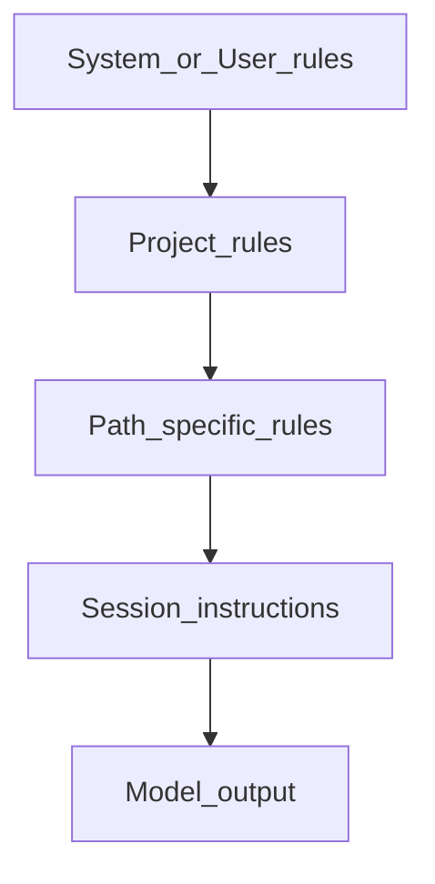

# Системи правил (Rules Systems): ієрархія інструкцій

<v-clicks>

- Правила — це **постійний контекст** (persistent context), а не “ще один промпт”
- Головна мета: **передбачуваність** і **командна стандартизація**

</v-clicks>

<!--
Вступ до ідеї багаторівневих інструкцій: @docs/chatgpt-reasearch.md.
-->

---

# Рівні інструкцій (Scopes)

<v-clicks>

- **System/User**: особисті уподобання (мова, стиль відповіді)
- **Project**: стек, архітектура, правила безпеки, стиль коду
- **Path-specific**: правила для `frontend/` vs `backend/`, тести, інфра тощо
- **Session**: конкретне завдання (тимчасовий контекст)

</v-clicks>

<!--
Cursor: user rules + project rules + team rules; Copilot: personal+repo+org.
-->

---

# Пріоритети та конфлікти: що “виграє”



<v-clicks>

- Чим **ближче до файлу/задачі**, тим правило зазвичай **специфічніше**
- Конфлікти вбивають якість → уникаємо дублювань і протиріч

</v-clicks>

<!--
Думка: конфліктні правила → деградація; описано в @docs/chatgpt-reasearch.md.
-->

---

# Cursor: `.cursorrules` (legacy) vs `.cursor/rules/*.mdc` (modern)

<v-clicks>

- Старий підхід: один файл `.cursorrules` (простий, але без гнучкого scope)
- Новий підхід: директорія `.cursor/rules/` з файлами `.mdc` + frontmatter
- Перевага: **точне застосування** правил за globs/умовами, менше шуму в контексті

</v-clicks>

<!--
Про депрекейт .cursorrules та перехід на .cursor/rules: @docs/gemini-research.md.
-->

---

# Cursor `.mdc`: мінімальний приклад правила

```yaml
---
description: Apply when working with authentication modules
globs: ["src/auth/**/*.ts", "src/middleware/auth*.ts"]
alwaysApply: false
---
```

<v-clicks>

- `globs`: коли правило підтягується автоматично
- `alwaysApply`: правило в контексті завжди (обережно)
- `description`: допомагає агенту зрозуміти, коли просити це правило

</v-clicks>

<!--
Приклад структури .mdc: @docs/gemini-research.md.
-->

---

# Cursor: режими застосування правил (практично)

<v-clicks>

- **Always**: додається в кожну сесію (тільки критичне)
- **Auto-attached**: підтягується, коли торкаємось файлів/шляхів (globs)
- **Agent-requested**: агент “просить” правило за описом
- **Manual**: застосовується лише коли ви явно додаєте/згадуєте

</v-clicks>

---

# Cursor: як організувати правила у проєкті

```text
.cursor/rules/
  workspace.mdc
  architecture.mdc
  frontend.mdc
  backend.mdc
  testing.mdc
  security.mdc
```

<v-clicks>

- Розділяйте за **доменом**, а не “все в одному файлі”
- Тримайте файли **короткими** і **актуальними**

</v-clicks>

---

# Claude Code: `CLAUDE.md` як “памʼять проєкту”

| Рівень | Де лежить | Навіщо |
| --- | --- | --- |
| Enterprise | `/etc/.../CLAUDE.md` | політики компанії |
| Project | `./CLAUDE.md` / `./.claude/CLAUDE.md` | правила команди |
| User | `~/.claude/CLAUDE.md` | особисті уподобання |
| Local | `./CLAUDE.local.md` | персональні локальні налаштування |

<!--
Ієрархія CLAUDE.md: @docs/gemini-research.md (Claude section).
-->

---

# Claude Code: рекомендована структура `CLAUDE.md`

```markdown
# Tech Stack
- Node 20, npm

# Critical Commands
- npm run build
- npm test

# Code Style
- No any, use strict typing

# Constraints (NEVER)
- Never commit secrets
```

<v-clicks>

- Мета: щоб агент **не галюцинував команди** і **не ламав конвенції**
- Файл має бути **коротким** (орієнтир: < 300 рядків)

</v-clicks>

<!--
Практики “коротко і директивно”: @docs/gemini-research.md / @docs/claude-research.md.
-->

---

# Claude: hooks & checkpoints (для workflow)

<v-clicks>

- **Hooks**: автоматичні тригери (наприклад, запуск тестів після “stop”)
- **Checkpoints**: знімки стану для легкого відкату
- Практичний ефект: менше “ручної рутини”, більше **автовалідації**

</v-clicks>

<!--
Hooks/checkpoints згадані в @docs/gemini-research.md (Claude Code section).
-->

---

# GitHub Copilot: repo instructions + path-specific

<v-clicks>

- Репозиторій: `.github/copilot-instructions.md`
- Path-specific: `.github/instructions/*.instructions.md` з `applyTo`
- Copilot зазвичай **комбінує** інструкції (personal + repo + org)

</v-clicks>

```markdown
# .github/copilot-instructions.md
- Use TypeScript strict
- Prefer async/await
- Run tests before suggesting changes
```

<!--
Система інструкцій Copilot описана в @docs/gemini-research.md.
-->

---

# `AGENTS.md` / `agents.md`: універсальний стандарт для агентів

<v-clicks>

- “README для агента”: точні команди, обмеження, середовище
- Працює як **крос-інструментний** baseline (Cursor / Roo / Cline / інші)
- Підтримує вкладеність у монорепо (локальні `agents.md`)

</v-clicks>

```markdown
## Environment & Commands
- Install: npm ci
- Build: npm run build
- Tests: npm test

## Boundaries
- NEVER commit secrets
- ASK BEFORE deleting files
```

<!--
AGENTS.md як стандарт і ризики: @docs/gemini-research-agents.md.
-->

---

# Ризик: prompt injection через репозиторій

<v-clicks>

- Інструкції (rules/agents.md) — це **високоризикові конфіги**
- Зловмисник може запропонувати PR зі “шкідливими правилами”
- Агент може виконати небезпечні дії, якщо довіряє інструкціям безконтрольно

</v-clicks>

<!--
Threat model “repo starts talking”: @docs/gemini-research-agents.md (security section).
-->

---

# Практичні принципи “хороших правил”

<v-clicks>

- **Конкретність**: не “пиши чисто”, а “max 30 lines, single responsibility”
- **Перевірність**: правило має мати перевірку (lint/test/build/checklist)
- **Лаконічність**: менше — краще (інакше правило тонe)
- **Безпека**: дозволи/deny-list, “ASK FIRST” для руйнівних дій
- **Процес**: зміни правил = PR + ревʼю (як CI/CD конфіги)

</v-clicks>

