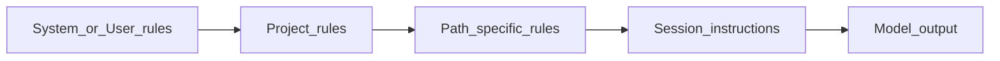

# Системи правил (Rules Systems): ієрархія інструкцій

<v-clicks>

- Правила — це **постійний контекст** (persistent context), а не “ще один промпт”
- Головна мета: **передбачуваність** і **командна стандартизація**.

</v-clicks>

<!--
Вступ до ідеї багаторівневих інструкцій: @docs/chatgpt-reasearch.md.
-->

---

# Рівні інструкцій (Scopes)

<v-clicks>

- **System/User**: особисті уподобання (мова, стиль відповіді)
- **Project**: стек, архітектура, правила безпеки, стиль коду
- **Path-specific**: правила для `frontend/` vs `backend/`, тести, інфра тощо
- **Session**: конкретне завдання (тимчасовий контекст).

</v-clicks>

<!--
Cursor: user rules + project rules + team rules; Copilot: personal+repo+org.
-->

---

# Пріоритети та конфлікти: що “виграє”

<div style="transform: scale(1); transform-origin: top center;">



</div>

<v-clicks>

- Чим **ближче до файлу/задачі**, тим правило зазвичай **специфічніше**
- Конфлікти вбивають якість → уникаємо дублювань і протиріч.

</v-clicks>

<!--
Думка: конфліктні правила → деградація; описано в @docs/chatgpt-reasearch.md.
-->

---

# Cursor: еволюція форматів правил

<v-clicks>

- **Legacy**: `.cursorrules` (один файл) — deprecated, але ще підтримується
- **v0.45+**: `.cursor/rules/*.mdc` (файли) — функціональні, але не рекомендовані для нових правил
- **v2.2+**: `.cursor/rules/*/` (папки) — **новий рекомендований формат** для кращої читабельності та підтримки.

</v-clicks>

<!--
Еволюція форматів: .cursorrules → .mdc файли → папки в .cursor/rules (v2.2+).
Документація: https://cursor.com/docs/context/rules#mdc-cursor-rules
-->

---

# Cursor `.mdc`: мінімальний приклад правила

```yaml
---
description: Apply when working with authentication modules
globs: ["src/auth/**/*.ts", "src/middleware/auth*.ts"]
alwaysApply: false
---
```

<v-clicks>

- `globs`: коли правило підтягується автоматично
- `alwaysApply`: правило в контексті завжди (обережно)
- `description`: допомагає агенту зрозуміти, коли просити це правило.

</v-clicks>

<!--
Приклад структури .mdc: @docs/gemini-research.md.
-->

---

# Cursor: режими застосування правил (практично)

<v-clicks>

- **Always**: додається в кожну сесію (тільки критичне)
- **Auto-attached**: підтягується, коли торкаємось файлів/шляхів (globs)
- **Agent-requested**: агент “просить” правило за описом
- **Manual**: застосовується лише коли ви явно додаєте/згадуєте.

</v-clicks>

---

# Cursor: як організувати правила у проєкті

```text
.cursor/rules/
  workspace.mdc
  architecture.mdc
  frontend.mdc
  backend.mdc
  testing.mdc
  security.mdc
```

<v-clicks>

- Розділяйте за **доменом**, а не “все в одному файлі”
- Тримайте файли **короткими** і **актуальними**.

</v-clicks>

---

# Як перевірити, що правила працюють?

<v-clicks>

- Правила — це "чорний ящик": важко побачити, чи вони дійсно застосовуються
- Потрібні **практичні методи валідації** для перевірки ефективності
- Різні підходи для різних систем (Cursor / Claude Code / Copilot).

</v-clicks>

<!--
Практичні методи перевірки правил: тестові сценарії, Developer Tools, A/B тестування.
-->

---

# Метод 1: Тестовий сценарій (Test Scenario)

<v-clicks>

- Створіть **специфічний запит**, який має тригерити правило
- Приклад: правило "Never use `SELECT *` in SQL"
- Запит: "Write a query to get all columns from Users table"
- **Очікуваний результат**: агент перераховує колонки явно, не використовує `SELECT *`.

</v-clicks>

```sql
-- ❌ Без правила: SELECT * FROM users;
-- ✅ З правилом: SELECT id, name, email FROM users;
```

<!--
Тестовий сценарій: ізольований запит, який демонструє роботу правила.
-->

---

# Метод 2: Запит до агента про активні правила

<v-clicks>

- Прямий запит: **"show rules applied in this session"**
- Агент має перерахувати активні правила з `.cursor/rules/` або `.cursorrules`
- Перевірка, чи агент **згадує правила в контексті** відповідей
- Якщо агент не знає про правила → вони не застосовуються.

</v-clicks>

```markdown
Користувач: "show rules applied in this session"
Агент: "Active rules: workspace.mdc, frontend.mdc (auto-attached)"
```

<!--
Перевірка через прямий запит до агента про активні правила.
-->

---

# Метод 3: A/B тестування

<v-clicks>

- **Тимчасово вимкнути** правило: перейменувати `.mdc` → `.mdc.off`
- Або перемістити файл з `.cursor/rules/`
- Повторити **той самий запит** до агента
- Порівняти результати: з правилом vs без правила.

</v-clicks>

```bash
# Вимкнути правило для тестування
mv .cursor/rules/frontend.mdc .cursor/rules/frontend.mdc.off

# Після тесту повернути
mv .cursor/rules/frontend.mdc.off .cursor/rules/frontend.mdc
```

<!--
A/B тестування: порівняння поведінки з правилом і без нього.
-->

---

# Метод 5: Перевірка globs та умов

<v-clicks>

- Переконайтеся, що **globs відповідають** файлам, з якими працюєте
- Перевірте `alwaysApply: true/false` — чи правило має застосовуватися завжди?
- Тестуйте **path-specific правила**: відкрийте файл, що має відповідати glob
- Перевірте `description` — чи достатньо опису для agent-requested режиму.

</v-clicks>

```yaml
---
globs: ["src/auth/**/*.ts"] # Перевірте: чи є такі файли?
alwaysApply: false # Чи має бути true?
description: "..." # Чи достатньо опису?
---
```

<!--
Перевірка метаданих правил: globs, alwaysApply, description.
-->

---

# Практичні індикатори успіху

<v-clicks>

- Агент **використовує команди** з правил (наприклад, `npm run build` замість `npm build`)
- Агент **дотримується стилю коду** з правил (Composition API, TypeScript strict)
- Агент **уникає заборонених патернів** (наприклад, не використовує `any` типи)
- Агент **згадує правила** в контексті відповідей ("According to project rules...").

</v-clicks>

<!--
Індикатори успішного застосування правил: поведінка агента відповідає правилам.
-->

---

# Claude Code: `CLAUDE.md` як “памʼять проєкту”

| Рівень     | Де лежить                             | Навіщо                            |
| ---------- | ------------------------------------- | --------------------------------- |
| Enterprise | `/etc/.../CLAUDE.md`                  | політики компанії                 |
| Project    | `./CLAUDE.md` / `./.claude/CLAUDE.md` | правила команди                   |
| User       | `~/.claude/CLAUDE.md`                 | особисті уподобання               |
| Local      | `./CLAUDE.local.md`                   | персональні локальні налаштування |

<!--
Ієрархія CLAUDE.md: @docs/gemini-research.md (Claude section).
-->

---

# Claude Code: рекомендована структура `CLAUDE.md`

```markdown
# Tech Stack

- Node 20, npm

# Critical Commands

- npm run build
- npm test

# Code Style

- No any, use strict typing

# Constraints (NEVER)

- Never commit secrets
```

<v-clicks>

- Мета: щоб агент **не галюцинував команди** і **не ламав конвенції**
- Файл має бути **коротким** (орієнтир: < 300 рядків).

</v-clicks>

<!--
Практики “коротко і директивно”: @docs/gemini-research.md / @docs/claude-research.md.
-->

---

# Claude: hooks & checkpoints (для workflow)

<v-clicks>

- **Hooks**: автоматичні тригери (наприклад, запуск тестів після “stop”)
- **Checkpoints**: знімки стану для легкого відкату
- Практичний ефект: менше “ручної рутини”, більше **автовалідації**

</v-clicks>

<!--
Hooks/checkpoints згадані в @docs/gemini-research.md (Claude Code section).
-->

---

# GitHub Copilot: repo instructions + path-specific

<v-clicks>

- Репозиторій: `.github/copilot-instructions.md`
- Path-specific: `.github/instructions/*.instructions.md` з `applyTo`
- Copilot зазвичай **комбінує** інструкції (personal + repo + org).

</v-clicks>

```markdown
# .github/copilot-instructions.md

- Use TypeScript strict
- Prefer async/await
- Run tests before suggesting changes
```

<!--
Система інструкцій Copilot описана в @docs/gemini-research.md.
-->

---

# `AGENTS.md`: універсальний стандарт для агентів

<v-clicks>

- “README для агента”: точні команди, обмеження, середовище
- Працює як **крос-інструментний** baseline (Cursor / Roo / Cline / інші)
- Підтримує вкладеність у монорепо (локальні `AGENTS.md`).

</v-clicks>

```markdown
## Environment & Commands

- Install: npm ci
- Build: npm run build
- Tests: npm test

## Boundaries

- NEVER commit secrets
- ASK BEFORE deleting files
```

<!--
AGENTS.md як стандарт і ризики: @docs/gemini-research-agents.md.
-->

---

# Ризик: prompt injection через репозиторій

<v-clicks>

- Інструкції (`AGENTS.md`, rules-файли, CI-конфіги) — це **високоризикові конфіги**
- Зловмисник може запропонувати PR зі “шкідливими правилами”
- Агент може виконати небезпечні дії, якщо довіряє інструкціям безконтрольно.

</v-clicks>

<!--
Threat model “repo starts talking”: @docs/gemini-research-agents.md (security section).
-->

---

# Практичні принципи “хороших правил”

<v-clicks>

- **Конкретність**: не “пиши чисто”, а “max 30 lines, single responsibility”
- **Перевірність**: правило має мати перевірку (lint/test/build/checklist)
- **Лаконічність**: менше — краще (інакше правило тонe)
- **Безпека**: дозволи/deny-list, “ASK FIRST” для руйнівних дій
- **Процес**: зміни правил = PR + ревʼю (як CI/CD конфіги).

</v-clicks>
