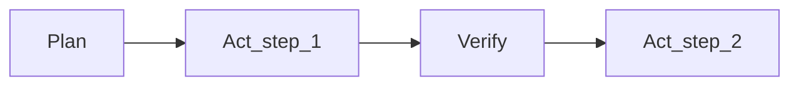

# Commands, Skills, Workflows

<v-clicks>

- **Rules**: політика (що дозволено/заборонено, стандарти)
- **Commands**: швидкі сценарії (готові промпт-шаблони)
- **Skills**: складні “процедури” (multi-step, з інструментами)

</v-clicks>

---

# Rules vs Commands vs Skills (коротко)

| Концепт | Навіщо | Приклад |
| --- | --- | --- |
| **Rules** | сталі рамки | “NEVER commit secrets” |
| **Command** | повторюваний запит | “/review this diff” |
| **Skill** | workflow з кроками | “Generate tests → run → fix” |

<v-clicks>

- Хороший агент = правила + інструменти + workflow, а не “один промпт”

</v-clicks>

---

# Commands: найпростіша автоматизація (приклад)

У цьому репозиторії є готовий шаблон-команда для вставки зображення:

```html
<div class="w-full flex justify-center">
  
</div>
```

<!--
Файл: .cursor/commands/image.md
-->

---

# Commands як “стандартизовані промпти” для команди

Приклад командного шаблону “згенеруй rules для проєкту”:

<v-clicks>

- запитує стек, структуру, стандарти
- формує **структурований** `.cursorrules`/rules
- зменшує “хаос різних підходів” у команді

</v-clicks>

<!--
Файл: .cursor/commands/gen-rules.md
-->

---

# Claude Code: custom slash commands (ідея)

```markdown
---
allowed-tools: Bash(git add:*), Bash(git commit:*)
argument-hint: [commit message]
description: Create a conventional commit
---
Stage all changes and create a commit with message: $ARGUMENTS
```

<v-clicks>

- Команди = “маленькі workflow”
- Вони дисциплінують і **стандартизують** взаємодію з агентом

</v-clicks>

<!--
Приклад зі структури slash commands: @docs/gemini-research.md (Claude Code section).
-->

---

# Skills: коли “команди” вже замало

<v-clicks>

- **Skill** = набір інструкцій + ресурси + (часто) правила tool use
- Корисно для: code review пайплайн, деплой, міграції, security audit
- Перевага: “знання” не губиться в чаті, а живе як **артефакт**

</v-clicks>

---

# Multi-agent vs sub-agent (Cursor vs Claude)

| Патерн | Ідея | Коли корисно |
| --- | --- | --- |
| **Multi-agent** | паралельні агенти з різними стратегіями | порівняти підходи |
| **Sub-agents** | допоміжні підзадачі під керуванням одного агента | великі зміни системно |

<!--
Порівняння Cursor vs Claude Code: @docs/chatgpt-reasearch.md, @docs/gemini-research.md.
-->

---

# Workflow: Plan/Act як страховка від “передчасного коду”

<v-clicks>

- Спочатку **план** (де/що/ризики/як перевіряємо)
- Потім **виконання** маленькими кроками
- Після кожного кроку: **перевірка** (build/test) + коротка рефлексія

</v-clicks>



---

# Командний “золотий шлях” (team default)

<v-clicks>

1. **Spec/Intent** (PRD/RFC) у репозиторії
2. **Plan**: список кроків + критерії успіху (DoD)
3. **Act**: мінімальні зміни + часті перевірки
4. **Verify**: build/test + security checklist
5. **Update**: rules/memory, якщо помилка повторюється

</v-clicks>

