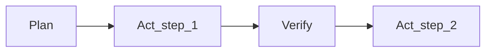

<Lang>
<template #uk>

# Commands, Skills, Workflows

<v-clicks>

- **Rules**: політика (що дозволено/заборонено, стандарти)
- **Commands**: швидкі сценарії (готові промпт-шаблони)
- **Skills**: складні “процедури” (multi-step, з інструментами).

</v-clicks>

</template>
<template #en>

# Commands, Skills, Workflows

<v-clicks>

- **Rules**: policy (what’s allowed/forbidden, standards)
- **Commands**: quick scenarios (ready prompt templates)
- **Skills**: complex “procedures” (multi-step, with tools).

</v-clicks>

</template>
</Lang>

---

<Lang>
<template #uk>

# Rules vs Commands vs Skills (коротко)

| Концепт     | Навіщо             | Приклад                      |
| ----------- | ------------------ | ---------------------------- |
| **Rules**   | сталі рамки        | “NEVER commit secrets”       |
| **Command** | повторюваний запит | “/review this diff”          |
| **Skill**   | workflow з кроками | “Generate tests → run → fix” |

<v-clicks>

- Хороший агент = правила + інструменти + workflow, а не “один промпт”.

</v-clicks>

</template>
<template #en>

# Rules vs Commands vs Skills (short)

| Concept     | Why                | Example                      |
| ----------- | ------------------ | ---------------------------- |
| **Rules**   | stable boundaries  | “NEVER commit secrets”       |
| **Command** | repeatable request | “/review this diff”          |
| **Skill**   | workflow with steps| “Generate tests → run → fix” |

<v-clicks>

- A good agent = rules + tools + workflow, not “one prompt”.

</v-clicks>

</template>
</Lang>

---

<Lang>
<template #uk>

# Commands: найпростіша автоматизація (приклад)

У цьому репозиторії є готовий шаблон-команда для вставки зображення (`.cursor/commands/image.md`):

```html
<div class="w-full flex justify-center">
  
</div>
```

<br>

Приклад командного шаблону “згенеруй rules для проєкту” (`.cursor/commands/gen-rules.md`):

<v-clicks>

- запитує стек, структуру, стандарти
- формує **структурований** `.cursorrules`/rules
- зменшує “хаос різних підходів” у команді.

</v-clicks>

</template>
<template #en>

# Commands: simplest automation (example)

This repo has a ready command template to insert an image (`.cursor/commands/image.md`):

```html
<div class="w-full flex justify-center">
  
</div>
```

<br>

Example command template “generate rules for a project” (`.cursor/commands/gen-rules.md`):

<v-clicks>

- asks for stack, structure, standards
- builds **structured** `.cursorrules`/rules
- reduces “chaos of different approaches” in the team.

</v-clicks>

</template>
</Lang>

---

<Lang>
<template #uk>

# Claude Code: custom slash commands

```markdown
---
allowed-tools: Bash(git add:*), Bash(git commit:*)
argument-hint: [commit message]
description: Create a conventional commit
---

Stage all changes and create a commit with message: $ARGUMENTS
```

<v-clicks>

- Команди = “маленькі workflow”
- Вони дисциплінують і **стандартизують** взаємодію з агентом.

</v-clicks>

</template>
<template #en>

# Claude Code: custom slash commands

```markdown
---
allowed-tools: Bash(git add:*), Bash(git commit:*)
argument-hint: [commit message]
description: Create a conventional commit
---

Stage all changes and create a commit with message: $ARGUMENTS
```

<v-clicks>

- Commands = “small workflows”
- They discipline and **standardize** interaction with the agent.

</v-clicks>

</template>
</Lang>

<!--
Приклад зі структури slash commands: @docs/gemini-research.md (Claude Code section).
-->

---

<Lang>
<template #uk>

# Skills: коли “команди” вже замало

<v-clicks>

- **Skill** = набір інструкцій + ресурси + (часто) правила tool use
- Корисно для: code review пайплайн, деплой, міграції, security audit
- Перевага: “знання” не губиться в чаті, а живе як **артефакт**
- Детально про “пакування” skills: секція **Skills (SKILLS.md)** далі.

</v-clicks>

</template>
<template #en>

# Skills: when “commands” are no longer enough

<v-clicks>

- **Skill** = instruction set + resources + (often) tool-use rules
- Useful for: code review pipeline, deploys, migrations, security audits
- Benefit: “knowledge” doesn’t get lost in chat, it lives as an **artifact**
- Details on “packaging” skills: **Skills (SKILLS.md)** section later.

</v-clicks>

</template>
</Lang>

---

<Lang>
<template #uk>

# Multi-agent vs sub-agent (Cursor vs Claude)

| Патерн          | Ідея                                             | Коли корисно          |
| --------------- | ------------------------------------------------ | --------------------- |
| **Multi-agent** | паралельні агенти з різними стратегіями          | порівняти підходи     |
| **Sub-agents**  | допоміжні підзадачі під керуванням одного агента | великі зміни системно |

</template>
<template #en>

# Multi-agent vs sub-agent (Cursor vs Claude)

| Pattern         | Idea                                             | When useful           |
| --------------- | ------------------------------------------------ | --------------------- |
| **Multi-agent** | parallel agents with different strategies        | compare approaches    |
| **Sub-agents**  | helper sub-tasks under one agent’s control        | large, systemic changes |

</template>
</Lang>

<!--
Порівняння Cursor vs Claude Code: @docs/chatgpt-reasearch.md, @docs/gemini-research.md.
-->

---

<Lang>
<template #uk>

# Workflow: Plan/Act як страховка від “передчасного коду”

<v-clicks>

- Спочатку **план** (де/що/ризики/як перевіряємо)
- Потім **виконання** маленькими кроками
- Після кожного кроку: **перевірка** (build/test) + коротка рефлексія.

</v-clicks>



</template>
<template #en>

# Workflow: Plan/Act as insurance against “premature code”

<v-clicks>

- First **plan** (where/what/risks/how to verify)
- Then **execute** in small steps
- After each step: **verify** (build/test) + short reflection.

</v-clicks>


</template>
</Lang>

---

<Lang>
<template #uk>

# Командний “золотий шлях” (team default)

<v-clicks>

1. **Spec/Intent** (PRD/RFC) у репозиторії
2. **Plan**: список кроків + критерії успіху (DoD)
3. **Act**: мінімальні зміни + часті перевірки
4. **Verify**: build/test + security checklist
5. **Update**: rules/memory, якщо помилка повторюється.

</v-clicks>

</template>
<template #en>

# Team “golden path” (default)

<v-clicks>

1. **Spec/Intent** (PRD/RFC) in the repo
2. **Plan**: steps list + success criteria (DoD)
3. **Act**: minimal changes + frequent checks
4. **Verify**: build/test + security checklist
5. **Update**: rules/memory if the mistake repeats.

</v-clicks>

</template>
</Lang>
