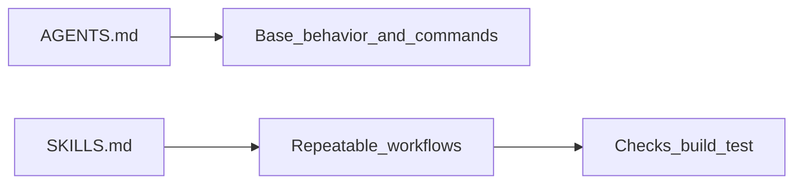

# Skills (SKILLS.md): deep dive

<v-clicks>

- **Skill** = упакований, повторюваний **workflow** (процедура), а не “просто промпт”
- Дає **стабільність**: одна й та сама задача → однакові кроки → однакові перевірки
- Добре масштабується на команду: “tribal knowledge” стає артефактом у репозиторії

</v-clicks>

<!--
Контекст: у багатьох agentic tooling зʼявилась ідея “skills” як модульних workflow.
Джерела і близькі патерни: @docs/chatgpt-reasearch.md (rules/commands/skills),
@docs/gemini-research.md (skills згадуються у Claude/Cursor контексті).
-->

---

# Коли робити skill (а не command)

<v-clicks>

- **Command**: короткий шаблон (“зроби X”) без складної логіки
- **Skill**: 5–15 кроків, є **перевірки**, є **обмеження**, є **edge cases**

</v-clicks>

<v-clicks>

Приклади, які майже завжди краще як skill:
- генерація тестів + запуск + фікс падінь
- code review за чеклістом + пропозиції правок
- міграція (з планом, поетапно, з валідацією)
- security review (OWASP/inputs/secrets/deps) + звіт

</v-clicks>

---

# SKILLS.md як “каталог процедур”

<v-clicks>

- `SKILLS.md` = список доступних skills у команді (1–2 абзаци на кожен)
- Перевага: агент/людина швидко знаходить **коли** застосовувати skill і **що буде на виході**
- Це доповнює `AGENTS.md`, який описує **середовище/команди/межі**

</v-clicks>



---

# Мінімальний шаблон одного skill у SKILLS.md

```markdown
## test-generator
When: після реалізації фічі або refactor
Inputs: список змінених файлів + acceptance criteria
Outputs: тести + команда запуску + результат прогону
Safety: no secrets, no destructive ops without ASK FIRST
Steps:
1) Generate tests (happy + unhappy paths)
2) Run tests
3) Fix failures, re-run until green
```

<!--
Мета шаблону: зробити skill “самодостатнім”: тригер → кроки → перевірка → вихід.
-->

---

# Принципи якісного skill

<v-clicks>

- **Single responsibility**: один skill = одна ціль
- **Explicit inputs/outputs**: що треба на вході і що очікуємо на виході
- **Verifiable steps**: кожен крок має перевірку (build/test/lint/checklist)
- **Guardrails**: “NEVER/ASK FIRST”, обмеження tool use, контроль мережі/секретів
- **Keep it small**: короткі інструкції + посилання на приклади/шаблони (не дублювати все)

</v-clicks>

<!--
Додатковий контекст (якщо потрібно для воркшопу): Agent Skills spec згадує метадані
на кшталт name/description/allowed-tools. Див. https://agentskills.io/specification
-->

