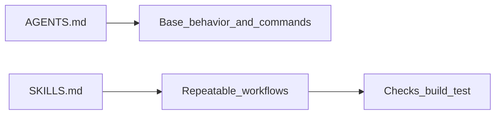

<Lang>
<template #uk>

# Skills (SKILLS.md): deep dive

<v-clicks>

- **Skill** = упакований, повторюваний **workflow** (процедура), а не “просто промпт”
- Дає **стабільність**: одна й та сама задача → однакові кроки → однакові перевірки
- Добре масштабується на команду: “неписані правила” стають артефактом у репозиторії.

</v-clicks>

</template>
<template #en>

# Skills (SKILLS.md): deep dive

<v-clicks>

- **Skill** = a packaged, repeatable **workflow** (procedure), not “just a prompt”
- Provides **stability**: same task → same steps → same checks
- Scales well for teams: “unwritten rules” become an artifact in the repo.

</v-clicks>

</template>
</Lang>

<!--
Контекст: у багатьох agentic tooling зʼявилась ідея “skills” як модульних workflow.
Джерела і близькі патерни: @docs/chatgpt-reasearch.md (rules/commands/skills),
@docs/gemini-research.md (skills згадуються у Claude/Cursor контексті).
-->

---

<Lang>
<template #uk>

# Коли робити skill (а не command)

<v-clicks>

- **Command**: короткий шаблон (“зроби X”) без складної логіки
- **Skill**: 5–15 кроків, є **перевірки**, є **обмеження**, є **edge cases**.

</v-clicks>

<v-clicks>

Приклади де краще використовувати skill:

- генерація тестів + запуск + фікс падінь
- code review за чеклістом + пропозиції правок
- міграція (з планом, поетапно, з валідацією)
- security review (OWASP/inputs/secrets/deps) + звіт.

</v-clicks>

</template>
<template #en>

# When to create a skill (not a command)

<v-clicks>

- **Command**: short template (“do X”) without complex logic
- **Skill**: 5–15 steps, with **checks**, **constraints**, **edge cases**.

</v-clicks>

<v-clicks>

Examples where a skill is better:

- test generation + run + fix failures
- code review by checklist + suggested changes
- migration (with plan, staged, validated)
- security review (OWASP/inputs/secrets/deps) + report.

</v-clicks>

</template>
</Lang>

---

<Lang>
<template #uk>

# SKILLS.md як “каталог процедур”

<v-clicks>

- `SKILLS.md` = список доступних skills у команді (1–2 абзаци на кожен)
- Перевага: агент/людина швидко знаходить **коли** застосовувати skill і **що буде на виході**
- Це доповнює `AGENTS.md`, який описує **середовище/команди/межі**.

</v-clicks>



</template>
<template #en>

# SKILLS.md as a “procedures catalog”

<v-clicks>

- `SKILLS.md` = list of available skills in the team (1–2 paragraphs each)
- Benefit: agent/human quickly finds **when** to use a skill and **what output** to expect
- This complements `AGENTS.md`, which describes **environment/commands/boundaries**.

</v-clicks>


</template>
</Lang>

---

<Lang>
<template #uk>

# Мінімальний шаблон одного skill у SKILLS.md

```markdown
## test-generator

When: після реалізації фічі або refactor
Inputs: список змінених файлів + acceptance criteria
Outputs: тести + команда запуску + результат прогону
Safety: no secrets, no destructive ops without ASK FIRST
Steps:

1. Generate tests (happy + unhappy paths)
2. Run tests
3. Fix failures, re-run until green
```

</template>
<template #en>

# Minimal template for a skill in SKILLS.md

```markdown
## test-generator

When: after implementing a feature or refactor
Inputs: list of changed files + acceptance criteria
Outputs: tests + run command + run result
Safety: no secrets, no destructive ops without ASK FIRST
Steps:

1. Generate tests (happy + unhappy paths)
2. Run tests
3. Fix failures, re-run until green
```

</template>
</Lang>

<!--
Мета шаблону: зробити skill “самодостатнім”: тригер → кроки → перевірка → вихід.
-->

---

<Lang>
<template #uk>

# Приклад: simple skill (у SKILLS.md)

Навіть “простий” skill має бути **перевірним** і давати однозначний вихід.

```markdown
## build-verify

When: після серії правок у слайдах
Inputs: робоче дерево репозиторію
Outputs: `npm run build` проходить (зелено)
Steps:

1. Run: npm run build
2. If failed: locate the slide/file from error output
3. Fix markdown/mermaid/import issue
4. Re-run: npm run build
```

</template>
<template #en>

# Example: simple skill (in SKILLS.md)

Even a “simple” skill should be **verifiable** and produce a clear output.

```markdown
## build-verify

When: after a series of slide edits
Inputs: repository working tree
Outputs: `npm run build` passes (green)
Steps:

1. Run: npm run build
2. If failed: locate the slide/file from error output
3. Fix markdown/mermaid/import issue
4. Re-run: npm run build
```

</template>
</Lang>

<!--
Це приклад “skill як процедура”, а не “запусти команду один раз”.
-->

---

<Lang>
<template #uk>

# Приклад: complex skill як пакет (SKILL.md + ресурси)

Іноді skill зручніше описувати як “пакет” з маніфестом `SKILL.md` + файлами-чеклістами.

```text
skills/
  code-review/
    SKILL.md
    checklist.md
    output-template.md
```

```markdown
---
name: code-review
description: Review changes with checklist, run checks, produce risks and suggestions
allowed-tools: Read, Grep, Bash(npm:*)
---

1. Read AGENTS.md + relevant rules
2. Review diff / changed files
3. Run: npm run build (and/or tests if configured)
4. Apply checklist.md (security, quality, consistency)
5. Output using output-template.md (summary, risks, next steps)
```

</template>
<template #en>

# Example: complex skill as a package (SKILL.md + resources)

Sometimes it’s better to describe a skill as a “package” with a `SKILL.md` manifest and checklist files.

```text
skills/
  code-review/
    SKILL.md
    checklist.md
    output-template.md
```

```markdown
---
name: code-review
description: Review changes with checklist, run checks, produce risks and suggestions
allowed-tools: Read, Grep, Bash(npm:*)
---

1. Read AGENTS.md + relevant rules
2. Review diff / changed files
3. Run: npm run build (and/or tests if configured)
4. Apply checklist.md (security, quality, consistency)
5. Output using output-template.md (summary, risks, next steps)
```

</template>
</Lang>

<!--
SKILL.md тут як приклад формату “agent skill manifest” (див. agentskills.io/specification).
-->

---

<Lang>
<template #uk>

# Принципи якісного skill

<v-clicks>

- **Single responsibility**: один skill = одна ціль
- **Explicit inputs/outputs**: що треба на вході і що очікуємо на виході
- **Verifiable steps**: кожен крок має перевірку (build/test/lint/checklist)
- **Guardrails**: “NEVER/ASK FIRST”, обмеження tool use, контроль мережі/секретів
- **Keep it small**: короткі інструкції + посилання на приклади/шаблони (не дублювати все).

</v-clicks>

</template>
<template #en>

# Principles of a high-quality skill

<v-clicks>

- **Single responsibility**: one skill = one goal
- **Explicit inputs/outputs**: what’s needed in, what’s expected out
- **Verifiable steps**: every step has a check (build/test/lint/checklist)
- **Guardrails**: “NEVER/ASK FIRST”, tool-use limits, network/secrets control
- **Keep it small**: short instructions + links to examples/templates (don’t duplicate everything).

</v-clicks>

</template>
</Lang>

<!--
Додатковий контекст (якщо потрібно для воркшопу): Agent Skills spec згадує метадані
на кшталт name/description/allowed-tools. Див. https://agentskills.io/specification
-->

---

<Lang>
<template #uk>

# Anthropic Skills repository

<div class="w-full flex justify-center">
  
</div>

<br>

<div class="w-full flex justify-center">
  <a href="https://github.com/anthropics/skills" target="_blank" >https://github.com/anthropics/skills</a>
</div>

</template>
<template #en>

# Anthropic Skills repository

<div class="w-full flex justify-center">
  
</div>

<br>

<div class="w-full flex justify-center">
  <a href="https://github.com/anthropics/skills" target="_blank" >https://github.com/anthropics/skills</a>
</div>

</template>
</Lang>
