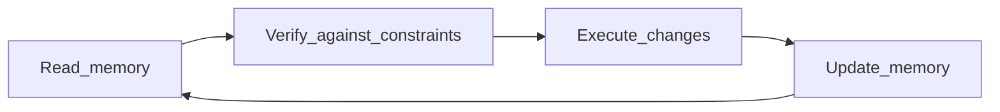

# Memory Bank: як зробити агента “stateful” (памʼятаючим)

<v-clicks>

- LLM за природою **stateless**
- Потрібна зовнішня памʼять → **файли в репозиторії**.

</v-clicks>

<!--
Memory Bank як патерн: @docs/chatgpt-reasearch.md (Memory Bank),
@docs/claude-research.md + @docs/gemini-research-agents.md.
-->

---

# Проблема: “амнезія” + context saturation

<v-clicks>

- Новий чат/сесія → модель не памʼятає, *чому* ми щось вирішили
- Довга сесія → важливе витісняється → агент дрейфує від правил
- Результат: **галюцинації**, rework, суперечливі рішення.

</v-clicks>

---

# Рішення: Memory Bank як “зовнішній мозок”

<v-clicks>

- Стандартизований набір markdown-файлів
- Агент **зобовʼязаний** читати їх на старті і оновлювати після роботи
- Це не “документація для галочки”, а **операційний контекст**

</v-clicks>

---

# Канонічна структура (приклад)

```text
docs/
  memory/
    projectbrief.md
    productContext.md
    systemPatterns.md
    techContext.md
    activeContext.md
    progress.md
    decisionLog.md
```

<v-clicks>

- `activeContext.md` = “оперативна памʼять” (what/why/next)
- `systemPatterns.md` = архітектурні патерни (як ми робимо)
- `decisionLog.md` = ключові рішення + мотивація (щоб не сперечатись знов).

</v-clicks>

<!--
Структура зібрана з @docs/gemini-research.md та @docs/claude-research.md.
-->

---

# `activeContext.md`: що там має бути

<v-clicks>

- **Current Focus**: що робимо прямо зараз
- **Constraints**: важливі обмеження задачі
- **Plan**: 3–7 кроків, коротко
- **Open Questions**: що треба уточнити
- **Next Steps**: чекліст наступних дій.

</v-clicks>

---

# Стабільні vs волатильні файли (volatility)

| Файл | Волатильність | Сенс |
| --- | --- | --- |
| `projectbrief.md` | низька | “полярна зірка” проєкту |
| `systemPatterns.md` | середня | патерни/архітектура |
| `techContext.md` | середня | стек, версії, команди |
| `activeContext.md` | висока | поточна задача |
| `progress.md` | висока | статус і прогрес |

---

# Протокол: Read → Verify → Execute → Update



<v-clicks>

- “Update memory” = агент навчився, а не ви “втомилися пояснювати”

</v-clicks>

---

# Рівні складності задач (щоб не “переплановувати” просте)

<v-clicks>

- **Level 1**: quick fix → короткий план, швидка перевірка
- **Level 2**: фіча в модулі → план + тести
- **Level 3–4**: нова система/міграція → дизайн варіантів + ризики + поетапність.

</v-clicks>

---

# Фази workflow (приклад)

<v-clicks>

- **Triage**: оцінка, чи потрібен детальний процес
- **Plan**: план без коду (що/де/як перевіряємо)
- **Design**: альтернативи, trade-offs (pros/cons)
- **Build**: імплементація за планом
- **Reflect**: ревʼю результату + оновлення правил/патернів
- **Archive**: зафіксувати підсумок, “очистити” активний контекст

</v-clicks>

<!--
Опис фаз: @docs/gemini-research-agents.md (framework section).
-->

---

# Чому Memory Bank реально зменшує галюцинації

<v-clicks>

- Агент бачить **прийняті рішення** → менше “вигадує з нуля”
- Менше суперечностей між сесіями
- Новий агент/людина швидше онбордиться (single source of truth).

</v-clicks>

---

# Типові помилки Memory Bank

<v-clicks>

- “Складали, але не оновлюємо” → стає **джерелом помилок**
- Дуже довгі файли → конкуренція за контекст
- Дублювання замість посилань/коротких тез
- Відсутність протоколу (“коли оновлюємо і хто”)

</v-clicks>

