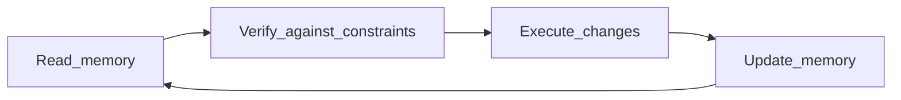

<Lang>
<template #uk>

# Memory Bank: як зробити агента “stateful” (памʼятаючим)

<v-clicks>

- LLM за природою **stateless**
- Потрібна зовнішня памʼять → **файли в репозиторії**.

</v-clicks>

</template>
<template #en>

# Memory Bank: how to make an agent “stateful”

<v-clicks>

- LLMs are **stateless** by nature
- You need external memory → **files in the repo**.

</v-clicks>

</template>
</Lang>

<!--
Memory Bank як патерн: @docs/chatgpt-reasearch.md (Memory Bank),
@docs/claude-research.md + @docs/gemini-research-agents.md.
-->

---

<Lang>
<template #uk>

# Проблема: “амнезія” + context saturation

<v-clicks>

- Новий чат/сесія → модель не памʼятає, *чому* ми щось вирішили
- Довга сесія → важливе витісняється → агент дрейфує від правил
- Результат: **галюцинації**, rework, суперечливі рішення.

</v-clicks>

</template>
<template #en>

# Problem: “amnesia” + context saturation

<v-clicks>

- New chat/session → the model doesn’t remember *why* decisions were made
- Long session → important info is pushed out → agent drifts from rules
- Result: **hallucinations**, rework, conflicting decisions.

</v-clicks>

</template>
</Lang>

---

<Lang>
<template #uk>

# Рішення: Memory Bank як “зовнішній мозок”

<v-clicks>

- Стандартизований набір markdown-файлів
- Агент **зобовʼязаний** читати їх на старті і оновлювати після роботи
- Це не “документація для галочки”, а **операційний контекст**

</v-clicks>

</template>
<template #en>

# Solution: Memory Bank as an “external brain”

<v-clicks>

- A standardized set of markdown files
- The agent **must** read them at the start and update after work
- This isn’t “docs for show”, it’s **operational context**.

</v-clicks>

</template>
</Lang>

---

<Lang>
<template #uk>

# Канонічна структура (приклад)

```text
docs/
  memory/
    projectbrief.md
    productContext.md
    systemPatterns.md
    techContext.md
    activeContext.md
    progress.md
    decisionLog.md
```

<v-clicks>

- `activeContext.md` = “оперативна памʼять” (what/why/next)
- `systemPatterns.md` = архітектурні патерни (як ми робимо)
- `decisionLog.md` = ключові рішення + мотивація (щоб не сперечатись знов).

</v-clicks>

</template>
<template #en>

# Canonical structure (example)

```text
docs/
  memory/
    projectbrief.md
    productContext.md
    systemPatterns.md
    techContext.md
    activeContext.md
    progress.md
    decisionLog.md
```

<v-clicks>

- `activeContext.md` = “working memory” (what/why/next)
- `systemPatterns.md` = architectural patterns (how we do things)
- `decisionLog.md` = key decisions + rationale (so we don’t argue again).

</v-clicks>

</template>
</Lang>

<!--
Структура зібрана з @docs/gemini-research.md та @docs/claude-research.md.
-->

---

<Lang>
<template #uk>

# `activeContext.md`: що там має бути

<v-clicks>

- **Current Focus**: що робимо прямо зараз
- **Constraints**: важливі обмеження задачі
- **Plan**: 3–7 кроків, коротко
- **Open Questions**: що треба уточнити
- **Next Steps**: чекліст наступних дій.

</v-clicks>

</template>
<template #en>

# `activeContext.md`: what it should include

<v-clicks>

- **Current Focus**: what we’re doing right now
- **Constraints**: important task constraints
- **Plan**: 3–7 steps, briefly
- **Open Questions**: what needs clarification
- **Next Steps**: checklist of next actions.

</v-clicks>

</template>
</Lang>

---

<Lang>
<template #uk>

# Стабільні vs волатильні файли (volatility)

| Файл | Волатильність | Сенс |
| --- | --- | --- |
| `projectbrief.md` | низька | PRD, опис проєкту |
| `systemPatterns.md` | середня | патерни/архітектура |
| `techContext.md` | середня | стек, версії, команди |
| `activeContext.md` | висока | поточна задача |
| `progress.md` | висока | статус і прогрес |

</template>
<template #en>

# Stable vs volatile files (volatility)

| File | Volatility | Purpose |
| --- | --- | --- |
| `projectbrief.md` | low | PRD, project description |
| `systemPatterns.md` | medium | patterns/architecture |
| `techContext.md` | medium | stack, versions, commands |
| `activeContext.md` | high | current task |
| `progress.md` | high | status and progress |

</template>
</Lang>

---

<Lang>
<template #uk>

# Протокол: Read → Verify → Execute → Update



<v-clicks>

- “Update memory” = агент навчився, а не ви “втомилися пояснювати”.

</v-clicks>

</template>
<template #en>

# Protocol: Read → Verify → Execute → Update


<v-clicks>

- “Update memory” = the agent learned, not you “got tired of explaining”.

</v-clicks>

</template>
</Lang>

---

<Lang>
<template #uk>

# Рівні складності задач (щоб не “переплановувати” просте)

<v-clicks>

- **Level 1**: quick fix → короткий план, швидка перевірка
- **Level 2**: фіча в модулі → план + тести
- **Level 3–4**: нова система/міграція → дизайн варіантів + ризики + поетапність.

</v-clicks>

</template>
<template #en>

# Task complexity levels (so you don’t over-plan simple work)

<v-clicks>

- **Level 1**: quick fix → short plan, quick check
- **Level 2**: module feature → plan + tests
- **Level 3–4**: new system/migration → design options + risks + staging.

</v-clicks>

</template>
</Lang>

---

<Lang>
<template #uk>

# Фази workflow (приклад)

<v-clicks>

- **Triage**: оцінка, чи потрібен детальний процес
- **Plan**: план без коду (що/де/як перевіряємо)
- **Design**: альтернативи, trade-offs (pros/cons)
- **Build**: імплементація за планом
- **Reflect**: ревʼю результату + оновлення правил/патернів
- **Archive**: зафіксувати підсумок, “очистити” активний контекст.

</v-clicks>

</template>
<template #en>

# Workflow phases (example)

<v-clicks>

- **Triage**: assess whether a detailed process is needed
- **Plan**: plan without code (what/where/how to verify)
- **Design**: alternatives, trade-offs (pros/cons)
- **Build**: implementation by the plan
- **Reflect**: review the result + update rules/patterns
- **Archive**: record the outcome, “clear” active context.

</v-clicks>

</template>
</Lang>

<!--
Опис фаз: @docs/gemini-research-agents.md (framework section).
-->

---

<Lang>
<template #uk>

# Чому Memory Bank реально зменшує галюцинації

<v-clicks>

- Агент бачить **прийняті рішення** → менше “вигадує з нуля”
- Менше суперечностей між сесіями
- Новий агент/людина швидше онбордиться (single source of truth).

</v-clicks>

</template>
<template #en>

# Why Memory Bank really reduces hallucinations

<v-clicks>

- The agent sees **accepted decisions** → less “making things up”
- Fewer contradictions between sessions
- New agent/person onboards faster (single source of truth).

</v-clicks>

</template>
</Lang>

---

<Lang>
<template #uk>

# Типові помилки Memory Bank

<v-clicks>

- “Складали, але не оновлюємо” → стає **джерелом помилок**
- Дуже довгі файли → конкуренція за контекст
- Дублювання замість посилань/коротких тез
- Відсутність протоколу (“коли оновлюємо і хто”).

</v-clicks>

</template>
<template #en>

# Common Memory Bank mistakes

<v-clicks>

- “Created, but not updated” → becomes a **source of errors**
- Very long files → compete for context
- Duplication instead of links/short notes
- No protocol (“when to update and who”).

</v-clicks>

</template>
</Lang>
