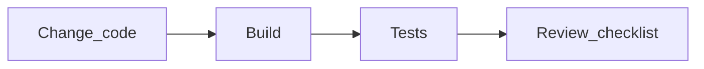

<Lang>
<template #uk>

# Якість, безпека, комплаєнс (Quality, Security, Compliance)

<v-clicks>

- Агент підсилює продуктивність **і** ризики
- Тому потрібні **guardrails + перевірки + процес**.

</v-clicks>

</template>
<template #en>

# Quality, security, compliance

<v-clicks>

- The agent boosts productivity **and** risks
- So you need **guardrails + checks + process**.

</v-clicks>

</template>
</Lang>

---

<Lang>
<template #uk>

# Антипатерни правил (Rules anti-patterns)

<v-clicks>

- **Надто довгі** правила → модель ігнорує частину
- **Суперечливі** правила → нестабільна поведінка
- **Розпливчаті** (“зроби краще”) → scope creep
- **Неперевірні** (“без вразливостей”, “O(1) завжди”) → самообман.

</v-clicks>

</template>
<template #en>

# Rules anti-patterns

<v-clicks>

- **Too long** rules → the model ignores part of them
- **Conflicting** rules → unstable behavior
- **Vague** (“make it better”) → scope creep
- **Unverifiable** (“no vulnerabilities”, “O(1) always”) → self-deception.

</v-clicks>

</template>
</Lang>

<!--
Антипатерни детально: @docs/chatgpt-reasearch.md, @docs/gemini-research.md.
-->

---

<Lang>
<template #uk>

# Definition of Done (DoD) для задачі агенту

<v-clicks>

- Що саме має бути зроблено (файли/функції/фічі)
- Які **обмеження** не порушити (API, міграції, ліцензії)
- Які **перевірки** мають пройти (build/test/lint)
- Який “неуспіх” (failure modes) і як реагуємо.

</v-clicks>

</template>
<template #en>

# Definition of Done (DoD) for an agent task

<v-clicks>

- What exactly must be done (files/functions/features)
- Which **constraints** must not be broken (APIs, migrations, licenses)
- Which **checks** must pass (build/test/lint)
- What “failure modes” are and how we respond.

</v-clicks>

</template>
</Lang>

---

<Lang>
<template #uk>

# Quality gates: “довіряй, але перевіряй”

<v-clicks>

- Мінімум: **build** після серії змін
- Добре: **tests** (особливо для бізнес-логіки)
- Ідеально: автоматизований цикл “поки зелене” (hooks/workflows).

</v-clicks>

</template>
<template #en>

# Quality gates: “trust, but verify”

<v-clicks>

- Minimum: **build** after a series of changes
- Better: **tests** (especially for business logic)
- Ideal: automated loop “until green” (hooks/workflows).

</v-clicks>

</template>
</Lang>

---

<Lang>
<template #uk>

# Security constraints (приклади “NEVER/ALWAYS”)

<v-clicks>

- ⛔ **NEVER**: хардкодити ключі/токени, додавати `.env` у git
- ✅ **ALWAYS**: валідувати інпути, параметризувати запити до БД
- ✅ **ALWAYS**: не логувати PII/секрети, не показувати stacktrace назовні
- ⚠️ **ASK FIRST**: мережеві запити, зміни IAM/ACL, відкриття портів.

</v-clicks>

</template>
<template #en>

# Security constraints (examples of “NEVER/ALWAYS”)

<v-clicks>

- ⛔ **NEVER**: hardcode keys/tokens, add `.env` to git
- ✅ **ALWAYS**: validate inputs, parameterize DB queries
- ✅ **ALWAYS**: don’t log PII/secrets, don’t expose stack traces
- ⚠️ **ASK FIRST**: network requests, IAM/ACL changes, opening ports.

</v-clicks>

</template>
</Lang>

---

<Lang>
<template #uk>

# Dependency hygiene (залежності)

<v-clicks>

- Використовуйте **актуальні** версії бібліотек (уникаємо CVE/старих API)
- Prefer “мейнстрімні” пакети з активною підтримкою
- Політики: allow-list / deny-list залежностей.

</v-clicks>

</template>
<template #en>

# Dependency hygiene

<v-clicks>

- Use **up-to-date** library versions (avoid CVEs/old APIs)
- Prefer “mainstream” packages with active maintenance
- Policies: dependency allow-list / deny-list.

</v-clicks>

</template>
</Lang>

---

<Lang>
<template #uk>

# Ліцензії (License compliance)

<v-clicks>

- Ризик: AI може генерувати фрагменти, схожі на OSS-код
- Мітигації: сканери ліцензій у CI, політики “no copyleft”, атрибуція
- Практика: “agent suggests deps, human approves licenses”.

</v-clicks>

</template>
<template #en>

# Licenses (license compliance)

<v-clicks>

- Risk: AI can generate fragments similar to OSS code
- Mitigations: license scanners in CI, “no copyleft” policies, attribution
- Practice: “agent suggests deps, human approves licenses”.

</v-clicks>

</template>
</Lang>

<!--
Про ризик “matching” коду і потребу сканінгу: @docs/gemini-research.md (license section).
-->

---

<Lang>
<template #uk>

# Privacy & data governance

<v-clicks>

- Не вставляємо в промпти: **PII**, ключі, приватні URL, внутрішні інциденти
- Правило: “AI output = untrusted input” (перевіряємо як код від джуна)
- Розділяємо: публічні приклади vs внутрішні дані.

</v-clicks>

</template>
<template #en>

# Privacy & data governance

<v-clicks>

- Never put in prompts: **PII**, keys, private URLs, internal incidents
- Rule: “AI output = untrusted input” (review like junior code)
- Separate: public examples vs internal data.

</v-clicks>

</template>
</Lang>

---

<Lang>
<template #uk>

# Ревʼю: агент як перший ревʼюер, людина як фінальний

<v-clicks>

- Агент-ревʼюер: стиль, безпека, edge cases, consistency
- Чекліст ревʼю: архітектура, тести, безпека, ліцензії, ризики
- Людина: підтверджує намір, бізнес-логіку, trade-offs.

</v-clicks>

</template>
<template #en>

# Review: agent as first reviewer, human as final

<v-clicks>

- Agent reviewer: style, security, edge cases, consistency
- Review checklist: architecture, tests, security, licenses, risks
- Human: confirms intent, business logic, trade-offs.

</v-clicks>

</template>
</Lang>
