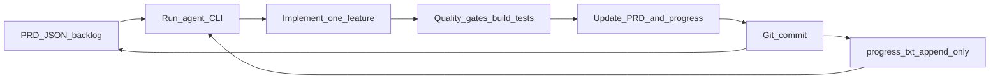

# Bonus: Ralph Wiggum loop (agent orchestration)

<v-clicks>

- Мрія: прокинутися і побачити **working code** з backlog
- Замість swarm/mesh/orchestrator — простий цикл: **1 задача → зміна → перевірка → commit**
- Трюк працює, коли є сильна модель + суворі **feedback loops**.

</v-clicks>

<!--
Термін “Ralph Wiggum” приписують Jeffrey Huntley (публікація: 14 липня).
Схожі ідеї: Anthropic “Effective harnesses for long-running agents” (PRD JSON + robust feedback loops).
-->

---
layout: center
---

# Чому не “swarm” і не “mega-plan”

<v-clicks>

- Swarm/mesh: merge conflicts + приховані залежності
- Один великий план: context saturation → дрейф і гірша якість
- Інженерний цикл: взяв top-priority item → закрив → повернувся на board.

</v-clicks>

---
layout: center
---

# Артефакти: PRD + progress + git history

<v-clicks>

- `prd.json` = PRD (Product Requirements Document) як backlog з `passes: true/false`
- `progress.txt` = append-only “оперативна памʼять” спринту (що дізналися/зробили)
- Кожна ітерація = **1 фіча + 1 commit** → легко знайти “що зламало” і відкотитись.

</v-clicks>

---
layout: center
---

# Loop як “канбан” для агента



<v-clicks>

- Backstop: max iterations (щоб цикл не був нескінченним)
- Stop condition: агент друкує `PROMPT_COMPLETE` коли все `passes: true`.

</v-clicks>

---
layout: center
---

# Мінімальний harness (bash)

```bash
set -euo pipefail

max="${1:?usage: ralph.sh <max-iterations>}"
agent="${AGENT_CMD:-codex}" # або claude/openai/cursor-cli/etc

for i in $(seq 1 "$max"); do
  echo "=== Iteration $i/$max ==="

  out="$("$agent" \
    --context plans/prd.json \
    --context plans/progress.txt \
    --prompt "Pick the highest-priority failing PRD item. Implement ONLY that. Run build/tests. 
    Update prd.json (passes=true) + append progress.txt. Commit. If all items pass, print PROMPT_COMPLETE.")"

  [[ "$out" == *"PROMPT_COMPLETE"* ]] && break
done
```

---
layout: center
---

# Щоб це реально “шипилось” (ship)

<v-clicks>

- Ріжемо PRD на дрібні items: **одна ітерація = одна невелика зміна**
- Quality gates: `build/test/typecheck` мають лишатися зеленими (ідеально — CI)
- Варіанти: AFK (overnight) vs human-in-the-loop (run once → steer → rerun)
- Роль людини: сформулювати “що правильно”, потім зробити review і поправити PRD.

</v-clicks>

